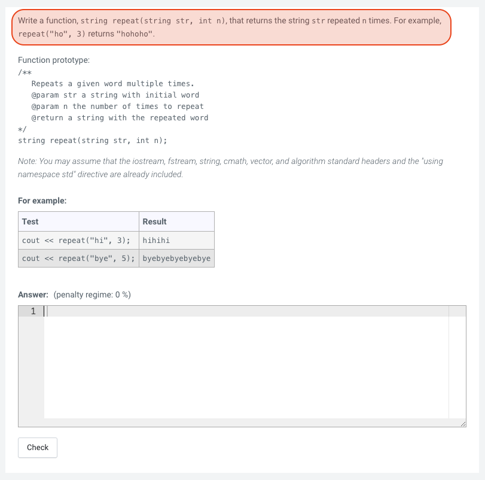
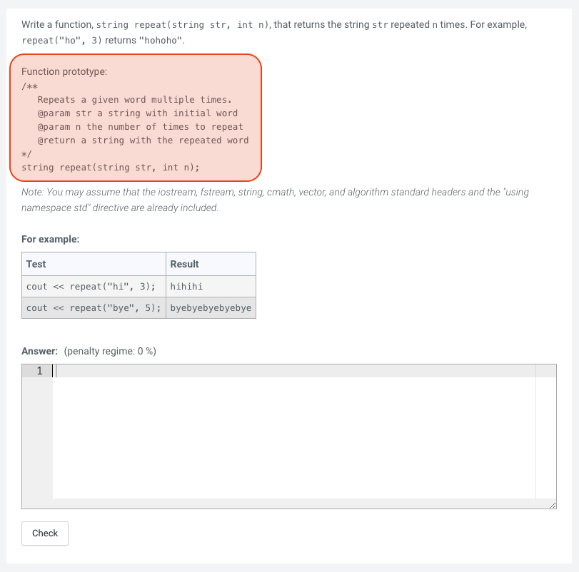
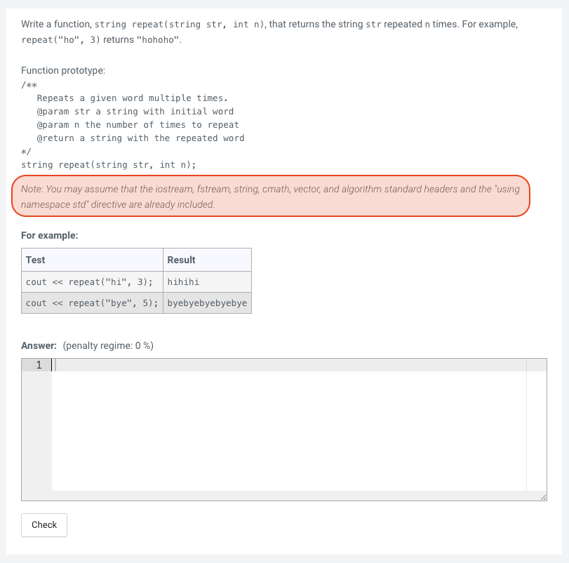
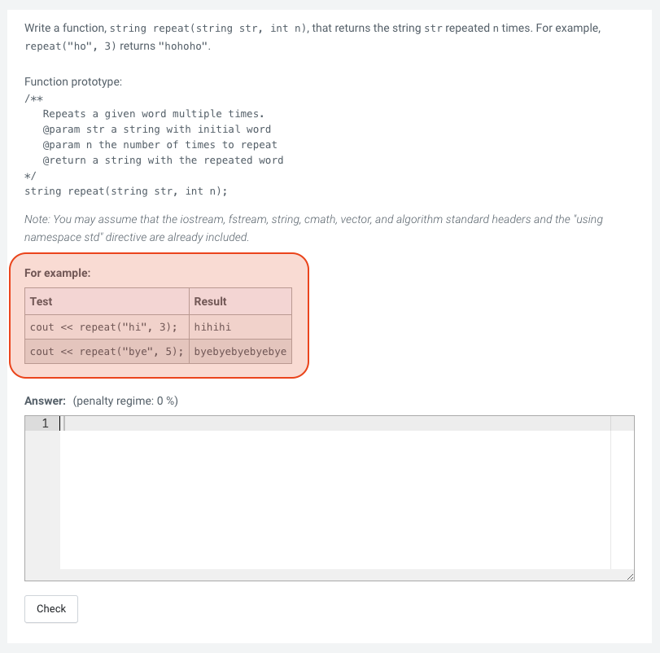
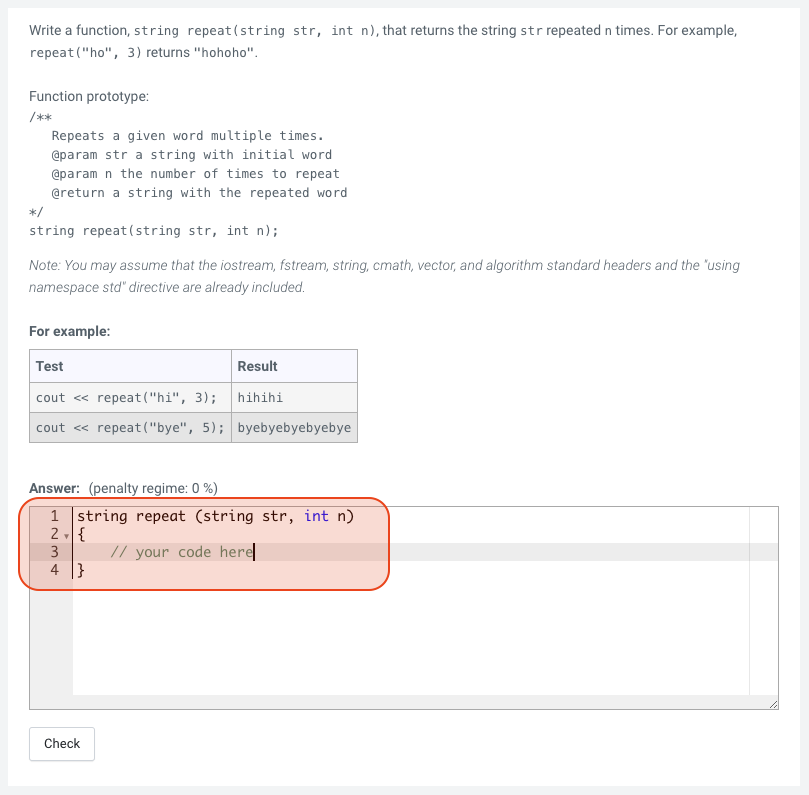

# Instructions For "Write a Function" Problems
Up until now on the assignments, you've been asked to write a program. This entailed including the entire program code, including the main function, capturing user input, and displaying output to the user. Many of the problems from now on will ask you to instead write a function. For the function questions, you will NOT include the entire program code, main function, or perform any input or output operations (unless the problem explicitly asks you to do that in your function). Instead, you are to just include the requested function(s), any helper functions needed by your function(s), and any headers (using the include statements) required by your function(s).

## OVERVIEW

All "write a function" problems will have a similar user interface. There will be a problem description at the top:
 

The function prototype(s) will be included that tells you the function name, return type, and input parameters:
 

There will be a short note on what assumptions you can make about already included headers and statements that you don't have to include yourself:
 

Under the For Example section, there will be a table listing one or two example test cases and the expected result after running those test cases. One important difference between the test cases for the "write a program" questions and the "write a function" questions is that for the "write a program" questions, you were given examples on the expected input and output from your code. That is, your code has to actually generate the output shown. However, for the "write a function" questions, the code shown under the Test column is the code that the grader is going to run and the Result column shows the expected output after running that test code. Therefore, you just need to include the function definition for these problems and the grader is going to test your function by passing in the required arguments and testing that your function is returning the correct return value (if any).
 

Write your function(s) inside of the answer box. Include any helper functions or headers required by your function(s).
 

Once you have your code written, click on the ***Check*** button to have the grader run the test code and call your function.

## Some tips:
1. Copy the function prototype given in the problem as a starting point for your code so you have the correct function name, return type, and function parameters. Of course, don't include the semicolon (;) you see in the function prototype in your function definition line!

1. Once your function is ready for testing, copy the test code under the Test column in the ***For example*** section into your main function in your code editor and use it to test your function against the expected result under the ***Result*** column. You can always create additional test cases of your own.