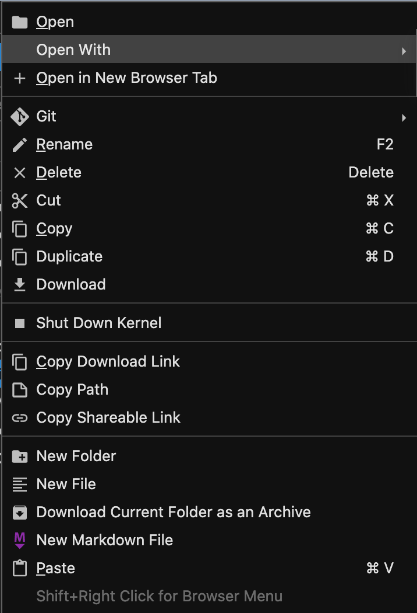
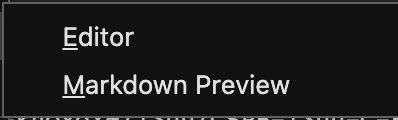

# CSPB-1300-Arrays-and-Vectors
Accessing the description of homework for CSPB-1300

This repository is a set of documents to be read before beginning your C++ homework on Arrays and Vectors. 
The assignment is based on the chapters in the Big C++ book that have been assigned for this week. 
 
##IMPORTANT NOTES THIS WEEK:
Some of the features this week may require you to compile using the C++11 standard. From now on, you should compile your code using this standard. To compile your code using the C++11 standard, add the standard flag to your g++ command:
    
    g++ -std=c++11 -o executable_filename cpp_filename.cpp
    
This week the majority of the homework problems ask you to write a function. 
This is in contrast to the previous weeks where you entered the entire C++ program in the answer box. 
For the problems that ask you to write a function and not a program, please remember to only include the relevant function or functions and **DO NOT include the main function in your solution**. 
You are allowed to include as many helper functions in addition to the required function as you'd like. 
Also, the function prototype is given for each problem so you know exactly the required function name, return type, and required parameters. 

Please read the instruction page in the repository for more details on the functions required by the assignment.

### You will learn how to CLONE this repository into your JupyterHub Notebook. 

Please read the information posted in this repository carefully before getting started. It contains everything you need to know about the assignment. 

1. To CLONE the repository, go to your JuypterHub CS1300 machine.  
1. Click on the folder icon  
to make sure you are in the top level directory.
1. Click on the _Git_ icon  
to see the GIT tools.
1. Select *Clone a Repository*, give it the URL for the CSPB-1330-C-Final-Project repository at which you are currently looking, and select *CLONE*. 
(GIT Project: https://github.com/CSCI-KNOX/CSPB-1300-C-Final-Project.git)
1. Select the folder icon and the CSPB-1300-C-Final_Project directory to see the files in the newly cloned directory.
View the markdown files (\*.md) by right clicking on the file, select **_open with_** which will list two possible applications: ***Editor*** and ***Markdown Preview***.  Select the ***Markdown Preview*** to view the document.  Use the ***Editor*** to view the source of the document.
  

1. View the markdown preview for the *Instructions* markdown file.
1. Begin writing the functions for the assignment.
